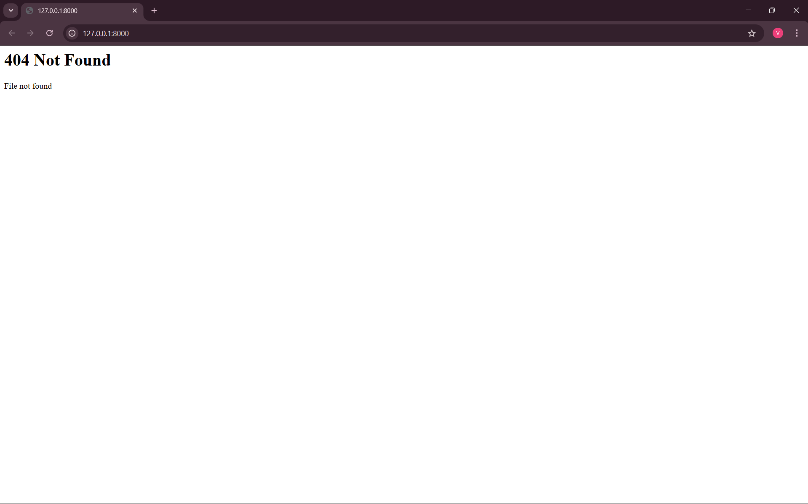

# EX01 Developing a Simple Webserver
## Date: 12.03.2025

## AIM:
To develop a simple webserver to serve html pages and display the list of protocols in TCP/IP Protocol Suite.

## DESIGN STEPS:
### Step 1: 
HTML content creation.

### Step 2:
Design of webserver workflow.

### Step 3:
Implementation using Python code.

### Step 4:
Import the necessary modules.

### Step 5:
Define a custom request handler.

### Step 6:
Start an HTTP server on a specific port.

### Step 7:
Run the Python script to serve web pages.

### Step 8:
Serve the HTML pages.

### Step 9:
Start the server script and check for errors.

### Step 10:
Open a browser and navigate to http://127.0.0.1:8000 (or the assigned port).

## PROGRAM:
```
from http.server import HTTPServer, BaseHTTPRequestHandler

class MyHandler(BaseHTTPRequestHandler):
    def do_GET(self):
        print("Request received")

        # Read content from file.html
        try:
            with open("index.html", "r", encoding="utf-8") as file:
                content = file.read()
        except FileNotFoundError:
            content = "<h1>404 Not Found</h1><p>File not found</p>"

        self.send_response(200)
        self.send_header('Content-type', 'text/html; charset=utf-8')
        self.end_headers()

        # Send the response
        self.wfile.write(content.encode())

# Create server address
server_address = ('127.0.0.1', 8000)

# Listen on the specified port
httpd = HTTPServer(server_address, MyHandler)
print("MY WEBSERVER IS RUNNING ON http://127.0.0.1:8000/")
httpd.serve_forever()
```

## OUTPUT:



## RESULT:
The program for implementing simple webserver is executed successfully.
